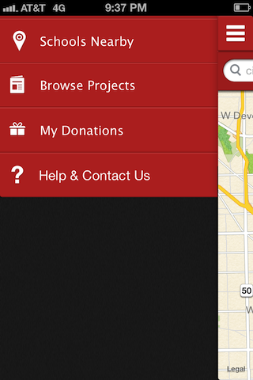
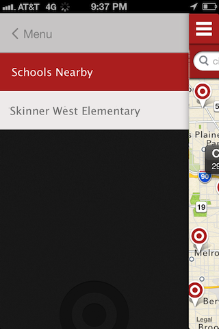
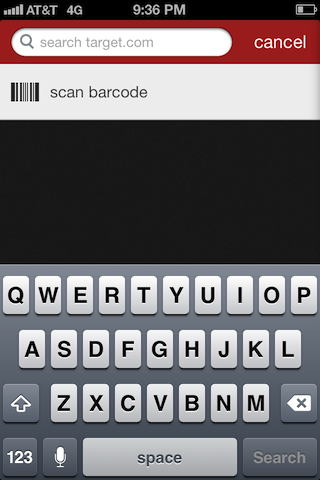
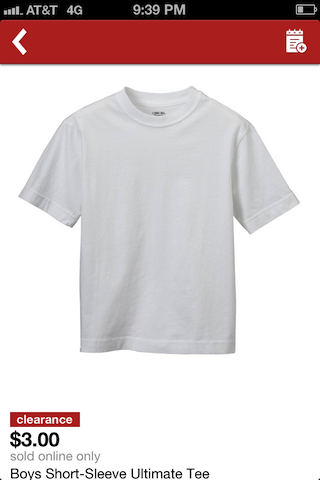
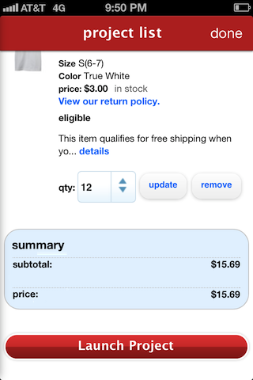

# UI Mockups

These images depict some of the steps in the scenario of a teacher creating a project for her class to tie-dye T-shirts.

First the teacher identifies their school:

After creating and describing her project, the teacher can scan or search for items:

Once all the items are added, the teach can launch the project!

